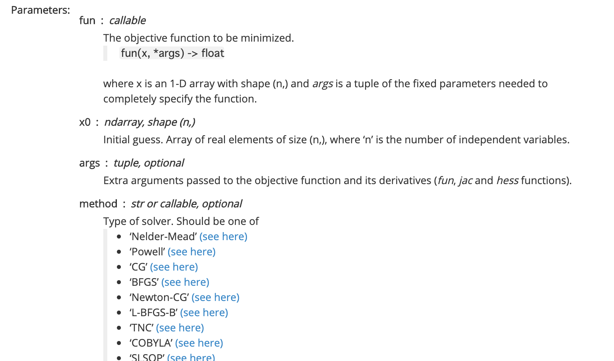
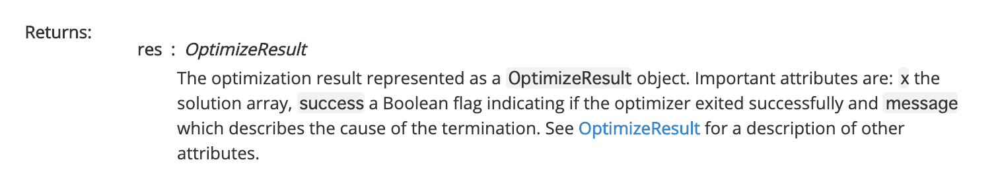
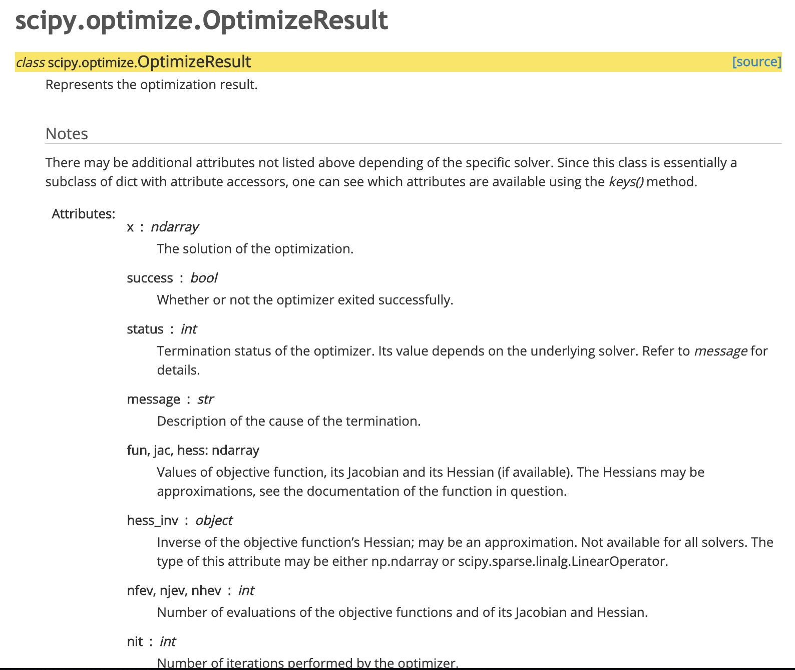

# 0.前説

ある程度の知識は持ってるとして資料作成

スクショ消してgithubにあげるつもり

独り言は()表記 <- 大切。

引用：https://github.com/ghmagazine/kagglebook

# 2.1 タスクの種類分類

### 回帰

- 連続値の予測
- 代表的な評価指標：RMSE、MAE


### 分類


**<u>2値分類</u>**

- 0 or 1のクラス分類
- 代表的な評価指標
  - クラス分類の場合：F1-score
  - 確率予測の場合：logloss / auc
- 補足
  - (案件では、precision / recallのトレードオフの話は気をつけよう)
  - (何億回経験した話だか。。。)
  - (さらに、「モデルの出力は1って言ってて、確かにこのデータのラベル0じゃなくて1じゃね？」と定義の話になると大変。。。)


<u>**多クラス分類**</u>

- 0 or 1 or ... nの正解ラベル	

<u>多クラス分類 / マルチ「クラス」分類</u>

- 1データが1つのクラスにしか属せない
- 代表的な評価指標：logloss、（書いてないけど。正答率も？）

<u>多クラス分類 / マルチ「ラベル」分類</u>

- 1つのデータが複数のクラスに属せる
- 代表的な評価指標：logloss、marcoF1


**<u>レコメンデーション</u>**

- ユーザの購買しそうなアイテムを予測
- 複数個レコメンド(しかもユーザごとに異なる個数個)レコメンドできるタスクも
- 確率の順位
  - なし：マルチ「ラベル」分類と同等
  - あり
    - 各アイテムへの購買確率出して上位N商品をレコメンド
    - 代表的な評価指標：MAP@K

<u>**その他**</u>

画像のodとssの話がチョロっと


# 2.2 分析のデータセット

**<u>テーブルデータ</u>** 

- 結合(merge / join)の量によっては時間かかるので注意
- (案件では最初に小さめのデータ作って結合させて、合ってるかのdebugをしている)

**<u>外部データ</u>**

- discussion読もう
- (一般的に、画像 / NLPでは学習済みモデル使いたい)

**<u>時系列データ</u>**

- CVとか厄介
- 詳しくは後の3.10 / 5.3で.

**<u>画像 / NLP</u>**

- この本のスコープ外(販売が楽しみですね)
- だいたい、NN


# 2.3評価指標

**<u>評価指標とは？</u>**

学習させたモデルの良し悪しを測る指標。こいつで順位が決まる

**実務の際に気を付けるポイント**

- 既になんらかのシステムで評価指標が決まっている場合はそれに従おう
- そもそも、評価指標とは何を持って評価とするかの定義の際には、ちゃんとKPIとかビジネスインパクトに結びつくように考えようね。
  - （本当にF値を上げることが正義？ってことは多々）


## 回帰の評価指標

**<u>RMSE</u>**

$\sqrt{1 / N \sum_{I=1} ^N (y_i - \hat{y}_i)^2}$

```python
# y_trueが真の値、y_predが予測値
y_true = [1.0, 1.5, 2.0, 1.2, 1.8]
y_pred = [0.8, 1.5, 1.8, 1.3, 3.0]

rmse = np.sqrt(mean_squared_error(y_true, y_pred))
print(rmse)
# 0.5532
```

- 誤差に正規分布を仮定した際の最尤推定解と同じ（知ってますよね）
- (2乗するので)MAEよりも外れ値に弱い。なので、外れ値に引っ張られてる可能性も

**<u>RMSLE</u>**

$\sqrt{1 / N \sum_{I=1} ^N (\log (y_i+1) - \log (\hat{y}_i+1))^2}$

- ($\log 0$は計算できないので+1。当たり前)
- 目的変数を対数変換してた値を新たな目的変数とする際にはこれ。
- こんな時に使う
  - 目的変数が裾の重い分布を持つ + log変換しないと外れ値が悪さをする時
  - 真の値と予測値の比率に着目したい時(<- いつ？例が欲しい) <- (予測と何倍ずれたか。)
    - 数式的に$\log (y_i+1) - \log (\hat{y}_i+1) = \log \frac{1+y_i}{1+\hat{y}_i}$で比率


メモ

- 大きいときは、キニシタクナイ
  - （例：レストランの訪問人数に対して、CMで突然バズったのを重視したくない）

- 案件でlog-log変換した経験もある(x, yもlogとる)
  - 線形っぽくなる場合もある（小声）


**<u>MAE</u>**

$1/N \sum_{i=1}^N |y_i - \hat{y}_i|$

- 外れ値の影響減
  - (huberlossとかありますよね。強化学習ではめっちゃ使う[https://ja.wikipedia.org/wiki/Huber%E6%90%8D%E5%A4%B1](https://ja.wikipedia.org/wiki/Huber損失))

**<u>決定係数</u>**

$R^2 = 1- \frac{\sum_{i=1}^N (y_i-\hat{y}_i)^2}{\sum_{i=1}^N (y_i-\bar{y})^2}$

- 分子が定数なので、RMSEの最適化問題に帰着
- 1のがgood

メモ

- レンジが決まってるのでお客さんに説明しやすい（小声）


## 2値分類の評価指標

以下の2つのパターンに分解できる

- ラベルを予測する場合（データ1はクラスAだ）
- ラベルへの確率を予測する場合（データ1はクラスAである確率が0.8だ）


### ラベルを予測する場合

**<u>confusion_matrix(混合行列)</u>**

- TPとかFPとか
  - TP(真陽性)：本当が正で予測も正
  - FP：本当が負で予測は正
  - （以下略）
- (異常検知のとき)
  - (正が不良 (1が不良))(ややこしい)
  - (個人的には、見逃し / 誤検知って単語を使ってる)

```python
# 混同行列

from sklearn.metrics import confusion_matrix

# 0, 1で表される二値分類の真の値と予測値
y_true = [1, 0, 1, 1, 0, 1, 1, 0]
y_pred = [0, 0, 1, 1, 0, 0, 1, 1]

tp = np.sum((np.array(y_true) == 1) & (np.array(y_pred) == 1))
tn = np.sum((np.array(y_true) == 0) & (np.array(y_pred) == 0))
fp = np.sum((np.array(y_true) == 0) & (np.array(y_pred) == 1))
fn = np.sum((np.array(y_true) == 1) & (np.array(y_pred) == 0))

confusion_matrix1 = np.array([[tp, fp],
                              [fn, tn]])
print(confusion_matrix1)
# array([[3, 1],
#        [2, 2]])

# scikit-learnのmetricsモジュールのconfusion_matrixでも作成できるが、混同行列の要素の配置が違うので注意が必要
confusion_matrix2 = confusion_matrix(y_true, y_pred)
print(confusion_matrix2)
# array([[2, 1],
#        [2, 3]])
```

メモ

- sklearnの罠にはまった経験があるとかないとか
  - 結局自作が無難（小声）


**<u>accとerror_rate</u>**

acc = $(TP + TN) / (データ数)$ 

erro_rate - 1 - acc

- 不均衡データだと、使えないので、コンペではあまり使われない
- (Accで説明した方がお客さんの理解度はeasyだけど、案件でも気をつけようね)

```python
# accuracy

from sklearn.metrics import accuracy_score

# 0, 1で表される二値分類の真の値と予測値
y_true = [1, 0, 1, 1, 0, 1, 1, 0]
y_pred = [0, 0, 1, 1, 0, 0, 1, 1]
accuracy = accuracy_score(y_true, y_pred)
print(accuracy)
# 0.625
```


**<u>precision recall</u>**

$precision = \frac{TP}{TP+FP}$

$recall = \frac{TP}{TP+FN}$

- (いつも思うが、TPとかで表現するの逆に分かりにくくない？)
  - presicion：正を何割当てられたか
  - recall：無駄に正って予測していないか？コスパがいいか
- (恒例)誤検知と見逃しトレードオフ問題
  - Precision無視すれば、全部正って予測してrecall 100%にはできる
  - (案件で気をつけようね(n回目))
    - (100%無理だよとか、precesionに振り切るならrecallが下がってもいいね？とかの期待値調整。)
    - (オペレーション的にokとかも握るとbetter)

メモ

- 結局、混合行列見せて説明が（自分たち的にも）楽


**<u>F値</u>**

- precesionとrecallの調和平均
- recallをどれだけ大切にするかのF$_{\beta}$もある

$F_1 = \frac{2}{1/recall + 1/precesion} = \frac{2* recall * precesion}{recall + precesion} = \frac{2TP}{2TP+FP+FN}$

$F_{\beta} = \frac{1+\beta^2}{1/recall + 1/precesion} = \frac{(1+\beta^2) recall * precesion}{recall + \beta^2 precesion}$

メモ

- $F_{\beta}$は$F$値の一般化
- 案件的には$\beta$を悩む作業はしたくない
  - でも、最初から$\beta$決まってるならあり
  - しかし、「肌感と合わないので、$\beta$変えませんか？」ってどうせなる
    - 肌感大切。肌感driven(小声)


F1では、分子にTPのみなので、正例と負例をひっくり返すと結果が変わる

- 0, 1の定義を逆にするとFNがTPになってTPがFNになって結果変わるよねって話
- これへの対策として、MCCってのがある。（へぇー）


メモ
- MCC賢い
- ドヤ顔で使おうとすると、説明がやばい（小声）


### 確率を予測する場合

2値分類

**<u>loggloss</u>**

$logloss = -1/ N \sum_{i=1}^N(y_i \log p_i + (1-y_i)\log(1-p_i))$

- 正しいクラスをちゃんと高い確率で予測できましたか？ってスコア
- cross entropyとも呼ばれている


上式を$p_i$で微分すると、$\frac{\partial logloss}{\partial p_i} = \frac{p_i-y_i}{p_i(1-p_i)}$で、$p_i=y_i$で最小。(当たり前)

```python
# -----------------------------------
# logloss

from sklearn.metrics import log_loss

# 0, 1で表される二値分類の真の値と予測確率
y_true = [1, 0, 1, 1, 0, 1]
y_prob = [0.1, 0.2, 0.8, 0.8, 0.1, 0.3]

logloss = log_loss(y_true, y_prob)
print(logloss)
# 0.7136
```


**<u>AUC</u>**


(ここに、本のAUCのグラフの図)


- ROC曲線の面積

- ランダムだと直線で0.5。完全だと(0, 1)を通って1.0

- 別解釈

  - 正例と負例をそれぞれランダムに選んだ時に、正例の予測値が負例の予測値よりも大きい確率
  - $auc = \frac{(y_i =1, y_j=0, \hat{y}_i > \hat{y}_j)である(i,j)の組みの個数}{(y_i=1, y_j=0)である(i,j)の組みの個数}$

- 予測値の大小のみが値に影響([0.1, 0.3, 0.9, 0.7]と[0.01, 0.02, 0.99, 0.3]で同じ値)

- 正例が少ない場合は、正例の予測値にどれくらい高い確率を振れるかで値が変わる

  - 逆に負例はそこまで影響しない

- Gini係数 = 2*AUC -1 なので、Gini係数を高めるタスクはaucを高めるタスクと等価

  

作者のご意見コーナー

- 正答率など2値化が必要な指標の際には、確率値に対して閾値を決めてラベルを振る必要がある
- そこにはビジネス知識大切ですよね。病気の診断とメールの開封率タスクだと、全然違うよね。
  - (お客さんにlogglossなんぼです！！って説明しても困ると思うので、結局ラベル化と混合行列は必須だと思っている。)
  - (そもそも見逃しと誤検知ってどっちがヤバいかってのを先に握っておくの大切)
- 分析コンペなどの純粋なモデルの性能を競うことが目的であればloglossやaucがいいと思う
  - でもF1値のコンペとかあるから、ちゃんと評価指標を理解して取り組もうね


## 多値分類の評価指標

大体が2値分類モデルの評価指標の拡張


**<u>multi class accuracy</u>**

2値分類の拡張なので省略


**<u>multiclass logloss</u>**

$ - 1/ N \sum_{i=1}^{N}\sum_{m=1}^{M}y_{i,m} \log p_{i,m}$

データが所属するクラスの予測確率の対数を足し上げてるイメージ。

外しているデータは0が足される

(lossとmetricってめんどうですよね。小さい方がいいのか、大きい方がいいのかどっちか行方不明になることがある)

```python
# multi-class logloss

from sklearn.metrics import log_loss

# 3クラス分類の真の値と予測値
y_true = np.array([0, 2, 1, 2, 2])
y_pred = np.array([[0.68, 0.32, 0.00],
                   [0.00, 0.00, 1.00],
                   [0.60, 0.40, 0.00],
                   [0.00, 0.00, 1.00],
                   [0.28, 0.12, 0.60]])
logloss = log_loss(y_true, y_pred)
print(logloss)
# 0.3626
```


**<u>F値系</u>**

- mean - F1はデータごとにTPとかFPとか出せるので、データごとにF1値を求めて全データの平均
- macro - F1はクラスごとに算出して平均（各クラス独立に最適化できる）
- micro - F1はクラス、データごとに算出し平均

```python
# mean_f1, macro_f1, micro_f1

from sklearn.metrics import f1_score

# マルチラベル分類の真の値・予測値は、評価指標の計算上はレコード×クラスの二値の行列とした方が扱いやすい
# 真の値 - [[1,2], [1], [1,2,3], [2,3], [3]]
y_true = np.array([[1, 1, 0],
                   [1, 0, 0],
                   [1, 1, 1],
                   [0, 1, 1],
                   [0, 0, 1]])

# 予測値 - [[1,3], [2], [1,3], [3], [3]]
y_pred = np.array([[1, 0, 1],
                   [0, 1, 0],
                   [1, 0, 1],
                   [0, 0, 1],
                   [0, 0, 1]])

# mean-f1ではレコードごとにF1-scoreを計算して平均をとる
mean_f1 = np.mean([f1_score(y_true[i, :], y_pred[i, :]) for i in range(len(y_true))])

# macro-f1ではクラスごとにF1-scoreを計算して平均をとる
n_class = 3
macro_f1 = np.mean([f1_score(y_true[:, c], y_pred[:, c]) for c in range(n_class)])

# micro-f1ではレコード×クラスのペアごとにTP/TN/FP/FNを計算し、F1-scoreを求める
micro_f1 = f1_score(y_true.reshape(-1), y_pred.reshape(-1))

print(mean_f1, macro_f1, micro_f1)
# 0.5933, 0.5524, 0.6250

# scikit-learnのメソッドを使うことでも計算できる
mean_f1 = f1_score(y_true, y_pred, average='samples')
macro_f1 = f1_score(y_true, y_pred, average='macro')
micro_f1 = f1_score(y_true, y_pred, average='micro')
```


**<u>Quadratic Weighted Kappa</u>**

クラス間に順位がある多クラス分類（例：映画の評価）

数式の説明むずいので本のスクショ。(聞き飽きただろうしホワイトボード使う)

(後で見る人向けにもスクショ)

(ここにqwkの表のスクショ)

(DSBやってるときに、最初説明を見た時ナニモワカラナカッタ)

最近アライさんがいい感じの実装まとめ出してた

https://qiita.com/kaggle_master-arai-san/items/d59b2fb7142ec7e270a5


## レコメンドタスクの評価指標

(やっと ここまでたどり着いた)

$Map@K =  1/N \sum_{i=1}^{N} \big(  \frac{1}{min(m_i, K)} \sum_{k=1}^K p_i(k)\big)$

- (うん。数式で理解しにくい。黒澤先生は数式の方が分かりやすいらしい)

- $m_i$：$i$番目のデータの属しているクラスの数を表す

- $p_i(k)$は、$k$番目までの予測値で計算されてる$precision$

- (うん。本を見よう)( はい。理解)

- $K$個未満の予測を行い、評価値が下がることはないので普通は$K$個予測

- 予測値の順序（例：ランク1位のitemを上位確率で推薦できるか）が大切

  


```python
# MAP@K

# K=3、レコード数は5個、クラスは4種類とする
K = 3

# 各レコードの真の値
y_true = [[1, 2], [1, 2], [4], [1, 2, 3, 4], [3, 4]]

# 各レコードに対する予測値 - K=3なので、通常は各レコードにそれぞれ3個まで順位をつけて予測する
y_pred = [[1, 2, 4], [4, 1, 2], [1, 4, 3], [1, 2, 3], [1, 2, 4]]


# 各レコードごとのaverage precisionを計算する関数
def apk(y_i_true, y_i_pred):
    # y_predがK以下の長さで、要素がすべて異なることが必要
    assert (len(y_i_pred) <= K)
    assert (len(np.unique(y_i_pred)) == len(y_i_pred))

    sum_precision = 0.0
    num_hits = 0.0

    for i, p in enumerate(y_i_pred):
        if p in y_i_true:
            num_hits += 1
            precision = num_hits / (i + 1)
            sum_precision += precision

    return sum_precision / min(len(y_i_true), K)


# MAP@K を計算する関数
def mapk(y_true, y_pred):
    return np.mean([apk(y_i_true, y_i_pred) for y_i_true, y_i_pred in zip(y_true, y_pred)])


# MAP@Kを求める
print(mapk(y_true, y_pred))
# 0.65

# 正解の数が同じでも、順序が違うとスコアも異なる
print(apk(y_true[0], y_pred[0]))
print(apk(y_true[1], y_pred[1]))
# 1.0, 0.5833
```


# 2.4 評価指標と目的関数

目的関数

- モデルの学習において最適化される関数
- うまく学習が進む上では、微分可能などの制約がある
- 一般的には、回帰：RMSE / 分類：logloss

評価指標

- モデルや予測値の良し悪しを測る指標。とにかく計算できれば特に制約はない
- ビジネスの価値判断をもとにも決められるけど、目的関数としては扱いにくい場合も

評価指標と目的関数が一致しない場合

- 目的関数を最適化 != 評価指標の最適化の可能性もある
- どう最適化させていくかの例は2.5で


カスタム目的関数(自作目的関数)を作る

```python
# ---------------------------------
# データ等の準備
# ----------------------------------
import numpy as np
import pandas as pd

# train_xは学習データ、train_yは目的変数、test_xはテストデータ
# pandasのDataFrame, Seriesで保持します。（numpyのarrayで保持することもあります）

train = pd.read_csv('../input/sample-data/train_preprocessed.csv')
train_x = train.drop(['target'], axis=1)
train_y = train['target']
test_x = pd.read_csv('../input/sample-data/test_preprocessed.csv')

from sklearn.model_selection import KFold

kf = KFold(n_splits=4, shuffle=True, random_state=71)
tr_idx, va_idx = list(kf.split(train_x))[0]

# 学習データを学習データとバリデーションデータに分ける
tr_x, va_x = train_x.iloc[tr_idx], train_x.iloc[va_idx]
tr_y, va_y = train_y.iloc[tr_idx], train_y.iloc[va_idx]

# -----------------------------------
# xgboost におけるカスタム評価指標と目的関数の例
# （参考）https://github.com/dmlc/xgboost/blob/master/demo/guide-python/custom_objective.py
# -----------------------------------
import xgboost as xgb
from sklearn.metrics import log_loss

# 特徴量と目的変数をxgboostのデータ構造に変換する
# 学習データの特徴量と目的変数がtr_x, tr_x、バリデーションデータの特徴量と目的変数がva_x, va_yとする
dtrain = xgb.DMatrix(tr_x, label=tr_y)
dvalid = xgb.DMatrix(va_x, label=va_y)


# カスタム目的関数（この場合はloglossであり、xgboostの'binary:logistic'と等価）
def logregobj(preds, dtrain):
    labels = dtrain.get_label()  # 真の値のラベルを取得
    preds = 1.0 / (1.0 + np.exp(-preds))  # シグモイド関数
    grad = preds - labels  # 勾配
    hess = preds * (1.0 - preds)  # 二階微分値
    return grad, hess


# カスタム評価指標（この場合は誤答率）
def evalerror(preds, dtrain):
    labels = dtrain.get_label()  # 真の値のラベルを取得
    return 'custom-error', float(sum(labels != (preds > 0.0))) / len(labels)


# ハイパーパラメータの設定
params = {'silent': 1, 'random_state': 71}
num_round = 50
watchlist = [(dtrain, 'train'), (dvalid, 'eval')]

# モデルの学習の実行
bst = xgb.train(params, dtrain, num_round, watchlist, obj=logregobj, feval=evalerror)

# 目的関数にbinary:logisticを指定したときと違い、確率に変換する前の値で予測値が出力されるので変換が必要
pred_val = bst.predict(dvalid)
pred = 1.0 / (1.0 + np.exp(-pred_val))
logloss = log_loss(va_y, pred)
print(logloss)

# （参考）通常の方法で学習を行う場合
params = {'silent': 1, 'random_state': 71, 'objective': 'binary:logistic'}
bst = xgb.train(params, dtrain, num_round, watchlist)

pred = bst.predict(dvalid)
logloss = log_loss(va_y, pred)
print(logloss)
```


# 2.5評価指標の最適化

## 評価指標の最適化アプローチ

[Courseraのkaggle講座](https://ja.coursera.org/learn/competitive-data-science)曰く以下らしい

- 単に正しくモデリングを行う
- 学習データに前処理をして異なる評価指標を最適化する(例：目的変数のlogとってRMSE的な)
- 異なる評価指標の最適化を行い、後処理を行う(例：評価指標に基づいて閾値を決める)
- カスタム目的関数
- 異なる評価指標を最適化し、early stop


## 閾値の最適化

例：予測確率ではなく、 0 or 1のラベルを提出する場合（実務も大体これ）

- 通常、モデルで予測確率を算出し、ある閾値以上を正例として出力
- 単純に0.5ってせずに、F1値を最適化させる閾値探索

閾値探索方法

- とりうる閾値を全探索(例：0.01 ~ 0.99まで0.01刻みで探索)
- **最適化アルゴリズム**

`spicy/optimize`

- https://docs.scipy.org/doc/scipy/reference/optimize.html
- 初手：Neldee - Mead (微分不可にもいける)
- (ひとまず、引数を見よう)(ちょっと厄介)

入力

```python
scipy.optimize.minimize(fun, x0, args=(), method=None, jac=None, hess=None, hessp=None, bounds=None, constraints=(), tol=None, callback=None, options=None)
```




出力





実装例

```python
In [1]: import numpy as np
   ...: import pandas as pd
   ...:
   ...: # -----------------------------------
   ...: # 閾値の最適化
   ...: # -----------------------------------
   ...: from sklearn.metrics import f1_score
   ...: from scipy.optimize import minimize
   ...:
   ...: # サンプルデータ生成の準備
   ...: rand = np.random.RandomState(seed=71)
   ...: train_y_prob = np.linspace(0, 1.0, 10000)
   ...:
   ...: # 真の値と予測値が以下のtrain_y, train_pred_probであったとする
   ...: train_y = pd.Series(rand.uniform(0.0, 1.0, train_y_prob.size) < train_y_prob)
   ...: train_pred_prob = np.clip(train_y_prob * np.exp(rand.standard_normal(train_y_prob.shape) * 0.3), 0.0, 1.0)
   ...:
   ...: # 閾値を0.5とすると、F1は0.722
   ...: init_threshold = 0.5
   ...: init_score = f1_score(train_y, train_pred_prob >= init_threshold)
   ...: print(init_threshold, init_score)
   ...:
   ...:
   ...: # 最適化の目的関数を設定
   ...: def f1_opt(x):
   ...:     return -f1_score(train_y, train_pred_prob >= x)
   ...:
   ...:
   ...: # scipy.optimizeのminimizeメソッドで最適な閾値を求める
   ...: # 求めた最適な閾値をもとにF1を求めると、0.756 となる
   ...: result = minimize(f1_opt, x0=np.array([0.5]), method='Nelder-Mead')
   ...: best_threshold = result['x'].item()
   ...: best_score = f1_score(train_y, train_pred_prob >= best_threshold)
   ...: print(best_threshold, best_score)


0.5 0.7224831529507862
0.32324218749999983 0.7557317703844165

In [2]: result
Out[2]:
 final_simplex: (array([[0.32324219],
       [0.32319336]]), array([-0.75573177, -0.75573177]))
           fun: -0.7557317703844165
       message: 'Optimization terminated successfully.'
          nfev: 31
           nit: 14
        status: 0
       success: True
             x: array([0.32324219])
```

Nelder-mead 法とは？

From [wikipedia]([https://ja.wikipedia.org/wiki/%E3%83%8D%E3%83%AB%E3%83%80%E3%83%BC%E2%80%93%E3%83%9F%E3%83%BC%E3%83%89%E6%B3%95](https://ja.wikipedia.org/wiki/ネルダー–ミード法))

```
n + 1 個の頂点からなる n 次元の単体（シンプレックス）をアメーバのように動かしながら関数の最小値を探索する。反射、膨張、収縮の3種類を使い分けながら探索する。

Rの汎用的最適化の optim() のデフォルトのアルゴリズムとしても使われている。

線形計画法の1つであるシンプレックス法と名前はまぎらわしいが、基本的に無関係である
```

(は？)


解を含む空間を囲む多面体を縮小していくイメージ（多分）

https://www.youtube.com/watch?v=Db-9vFC3k-w

http://bicycle1885.hatenablog.com/entry/2015/03/05/040431

http://www.crl.nitech.ac.jp/~ida/education/ComputerScience/0308.pdf


## oofに対して、最適化しようねって話

上みたいなF1値を最大化する簡単な問題ならok

メリット

- 閾値のブレやスコアのブレを確認できる(CVごとの？)
- 複雑な最適化を行うときに有利なバリデーションスコアとなることを避けられる


CVごとに最適化した敷閾値の算出

テストデータには「CVごとの閾値の平均値」を適用

```python
import numpy as np
import pandas as pd

# -----------------------------------
# out-of-foldでの閾値の最適化
# -----------------------------------
from scipy.optimize import minimize
from sklearn.metrics import f1_score
from sklearn.model_selection import KFold

# サンプルデータ生成の準備
rand = np.random.RandomState(seed=71)
train_y_prob = np.linspace(0, 1.0, 10000)

# 真の値と予測値が以下のtrain_y, train_pred_probであったとする
train_y = pd.Series(rand.uniform(0.0, 1.0, train_y_prob.size) < train_y_prob)
train_pred_prob = np.clip(train_y_prob * np.exp(rand.standard_normal(train_y_prob.shape) * 0.3), 0.0, 1.0)

# クロスバリデーションの枠組みで閾値を求める
thresholds = []
scores_tr = []
scores_va = []

kf = KFold(n_splits=4, random_state=71, shuffle=True)
for i, (tr_idx, va_idx) in enumerate(kf.split(train_pred_prob)):
    tr_pred_prob, va_pred_prob = train_pred_prob[tr_idx], train_pred_prob[va_idx]
    tr_y, va_y = train_y.iloc[tr_idx], train_y.iloc[va_idx]

    # 最適化の目的関数を設定
    def f1_opt(x):
        return -f1_score(tr_y, tr_pred_prob >= x)

    # 学習データで閾値の最適化を行い、バリデーションデータで評価を行う
    result = minimize(f1_opt, x0=np.array([0.5]), method='Nelder-Mead')
    threshold = result['x'].item()
    score_tr = f1_score(tr_y, tr_pred_prob >= threshold)
    score_va = f1_score(va_y, va_pred_prob >= threshold)
    print(threshold, score_tr, score_va)

    thresholds.append(threshold)
    scores_tr.append(score_tr)
    scores_va.append(score_va)

# 各foldの閾値の平均をテストデータには適用する
threshold_test = np.mean(thresholds)
print(threshold_test)
```


(意外と知られてない)oofとは？

(本を見ながら説明)


## 予測確率の調整

予測確率が歪む（歪みやすい？）場合

- データ数が少ない場合
  - 0 or 1に偏る
- 学習アルゴリズム上、妥当な確率を予測するように最適化されない場合
  - logloss最適化なら基本問題ない
  - Random Forest !!!
  - (個人的にはoofの平均が、yの平均と一致しているかを目視している)

実際の対処法

- 予測値をn乗
- 極端に0,1に近い確率のクリッピング
- スタッキング
- Calibrated Classifier CV
  - https://scikit-learn.org/stable/modules/generated/sklearn.calibration.CalibratedClassifierCV.html
  - (社内wikiのリンク)
  - そういや、最近twitterでキャリブレーションの話盛り上がってた
    - https://twitter.com/threecourse/status/1207674123272511488?s=20
    - なるほど


# 2.6 評価指標の最適化の例

### balanced accuracy


$1/ M \sum_{m=1}^M \frac{r_m}{n_m}$

$M$：クラス数

$n_m$：クラスmに属するデータ数

$r_m$；クラスmに属するデータのうち正しく予測できたデータの数


意味としては、「少数のクラスをより正確に当てられればgood」ってイメージ

確率×クラスの割合の逆数 が最大となるクラスに予測ラベルを振る

(この指標、へーって感じでした)


## mean-F1

各オーダーIDごとに購入しそうな商品IDを複数予測するタスク

各オーダーIDごとに各商品の購買確率を予測し、それが閾値以上の商品IDを予測値として出力

-> オーダーIDごとに最適な閾値を求める方が評価指標を最適化できる


## quadratic weighted kappa

回帰で予測値だして、scipy.optimizeのminimize関数で最適化


## カスタム関数を使ってMAEの最適化

MAEは勾配不連続だし、二階微分が微分可能な点で0になってしまう

MAEっぽい微分可能な関数を導入

```python
import numpy as np
import pandas as pd


# -----------------------------------
# カスタム目的関数での評価指標の近似によるMAEの最適化
# -----------------------------------

# Fair 関数
def fair(preds, dtrain):
    x = preds - dtrain.get_labels()  # 残差を取得
    c = 1.0  # Fair関数のパラメータ
    den = abs(x) + c  # 勾配の式の分母を計算
    grad = c * x / den  # 勾配
    hess = c * c / den ** 2  # 二階微分値
    return grad, hess


# Pseudo-Huber 関数
def psuedo_huber(preds, dtrain):
    d = preds - dtrain.get_labels()  # 残差を取得
    delta = 1.0  # Pseudo-Huber関数のパラメータ
    scale = 1 + (d / delta) ** 2
    scale_sqrt = np.sqrt(scale)
    grad = d / scale_sqrt  # 勾配
    hess = 1 / scale / scale_sqrt  # 二階微分値
    return grad, hess
```


## MCCのPR-AUCによる近似とモデル選択

不均衡だと MCC が$\sqrt{Precision \times Recall}$で近似できる


メモ

- 結局「いくら」って変換するのがいい
  - こういう指標があってなー。これがこんだけよくなったら、いくらじゃーがわかりやすい
  - そもそも、金額換算できる問題? <- 大抵むずいし、データサイエンティストが期待値調整頑張る
- 向こうのビジネスインパクトに基づいた指標がベスト
  - 向こうのKPIを把握しないと。


# 2.7 リーク

### 予測に有用な情報が想定が外に漏れている意味でのリーク

割愛！！！

(案件でも気をつけようね)


### バリデーションの枠組みの誤りという意味でのリーク

バリデーションデータに目的変数を組み込んで学習してしまい、バリデーションデータに不当に高い値になってしまうこと

例

- 時系列データ
- (画像案件で、同じ画像でもcropした画像がtrain / valに跨っている)


